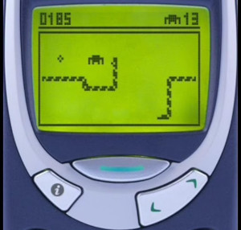
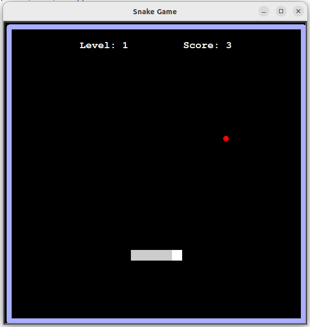
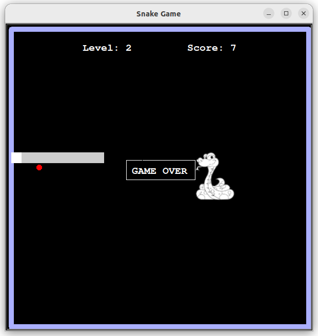

## Snake Game

OOP version [Snake](https://en.wikipedia.org/wiki/Snake_(video_game_genre)) Game written in Python using the turtle library. 
       
Snake is a sub-genre of action video games where the player maneuvers the end of a growing line, often themed as a snake. The player must keep the snake from colliding with both wall and itself, which gets harder as the snake lengthens.       




Try to play **Snake Game** on [google](https://g.co/kgs/sMDddp)


###### It's a part of the **#100DaysOfCode** challenge by *Angela Yu*. ######    


#### Prerequisites
You will need the following software to run the Snake Game:
 - [Python 3](https://www.python.org/downloads/)

#### Installation
To get started with the **Snake Game**, follow these steps:

1. **Clone** the repository:

```sh
git clone https://github.com/resole79/snake_game.git
```

2. **Run** the **main.py** file:

```sh
python main.py
```

#### File Structure   
 - **main.py**: Main program.
 - **snake.py**: Snake class
	- *Instance*: list_of_piece, head
	- *Method*: create_snake, tail, add_tail, move_snake, snake_right, snake_left, snake_up, snake_down
 - **food.py**: Food class
	- *Method*: random_food
 - **scoreboard.py**: Scoreboard class
	- *Instance*: score, level, level_speed
	- *Method*: game_over, increase_score, increase_leve, refresh_score
 - **display.py**: MyScreen class
	- *Instance*: list_of_window, this_window, x_coord, y_coord
	- *Method*: create_window, listen_snake
 - **bord.py**: BordGame class
	- *Method*: create_bord,

#### **Usage**

       




## **Credit**

Author : Emilio Reforgiato (resole79)

##
<p align="right"><a href="https://www.linkedin.com/in/emilio-reforgiato/" target=”_blank” ></a></p>


